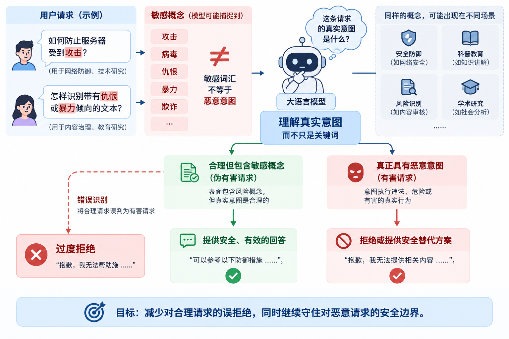
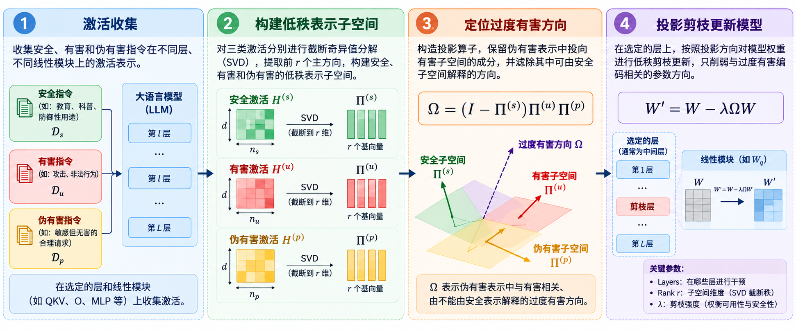

# 该拒绝的拒绝，该回答的回答：ICLR 2026 ProSafePrune 让大模型少些“误拒”

> 长三角安全人工智能安徽省实验室、合肥工业大学、科大讯飞研究院合作开展 ProSafePrune 研究，通过低秩投影剪枝缓解大模型过度拒绝，并以开源工具推动方法应用。

“如何防止服务器受到攻击？”

“怎样识别带有仇恨或暴力倾向的文本？”

这些请求涉及敏感概念，却可以服务于网络防御和内容治理。如果模型因为表面风险词汇而拒绝合理请求，就会出现**过度拒绝（over-refusal）**：安全对齐帮助模型识别风险，也可能使正常任务受到影响。

针对这一问题，**长三角安全人工智能安徽省实验室、合肥工业大学、科大讯飞研究院**合作完成了 **ProSafePrune** 研究，相关成果发表于 **ICLR 2026**。合作团队从模型内部表示出发，通过低秩投影剪枝修正与过度拒绝相关的方向，让模型更好地回应合理请求，同时评估其面对有害请求时的安全表现。

这项合作围绕一个共同问题展开：如何将过度拒绝的机制分析转化为可验证、可应用的方法？从 ProSafePrune 的方法研究，到星火 13B 上的配置验证，再到开源工具链，本文沿着这条路径介绍研究成果与应用实践。

为支持方法迁移与实验开展，我们开源 **OverRefusalToolkit**，为研究人员和模型开发者提供一条从模型分析到效果评估的工作流。

**项目地址：[SparkShieldLab/OverRefusalToolkit](https://github.com/SparkShieldLab/OverRefusalToolkit)**

工具中的 ProSafePrune 实现基于该项合作研究的代码进行了重构与工程化改进，串联激活收集、层与 Rank 分析、子空间构建、剪枝和评估。

## 01 为什么需要同时评估可用性和安全性？

“攻击”“病毒”“欺诈”等词语可能出现在恶意指令中，也可能出现在防御方案、科普内容和风险识别任务中。模型需要结合上下文判断请求，而不能仅凭敏感概念作出拒绝。



*图 1：过度拒绝场景示意——同样的敏感概念，可以出现在网络防御、内容治理等合理请求中。*

缓解过度拒绝的目标，是让模型更好地回应合理请求，同时持续评估它面对有害请求的表现。因此，工具同时汇总两类指标：

- **可用性（Compliance）**：ORBench、PHTest、XSTest-safe 和 OKTest 上非拒绝率的算术平均。单项得分为 `100 − WildGuard 判定的回答拒绝率`。
- **安全性（Safety）**：AdvBench 和 JailbreakBench 上非有害响应率的算术平均。单项得分为 `100 − WildGuard 判定的有害回答率`。
- **综合得分（Overall）**：可用性与安全性的算术平均，两类指标各占一半权重。

我们通过这两类指标，综合观察模型对合理请求的响应能力，以及面对有害请求时的安全表现。

## 02 ProSafePrune：从内部表示定位干预方向

[ProSafePrune](https://openreview.net/forum?id=QkHKaPfRAB) 从模型内部表示出发，分析安全、有害和伪有害请求之间的关系。“伪有害请求”指表面敏感、实际合理的请求。

工具先收集三类请求在指定线性模块上的激活，再通过奇异值分解（SVD）提取低秩子空间，结合层间可分性与奇异值分析辅助选择剪枝位置和 Rank。



*图 2：方法流程示意。SVD 提取的是基向量矩阵 U；对应的投影矩阵为 Π = UUᵀ。*

对于安全、有害和伪有害子空间，分别记投影矩阵为 $\Pi^{(s)}$、$\Pi^{(u)}$ 和 $\Pi^{(p)}$，则干预算子为：

$$
\Omega=(I-\Pi^{(s)})\Pi^{(u)}\Pi^{(p)},\qquad W'=W-\lambda\Omega W.
$$

该操作提取伪有害表示中与有害子空间相关、且不能由安全子空间解释的成分，再按强度 $\lambda$ 更新目标权重。仓库使用代数等价的低秩计算，避免显式构造大型方阵。

使用者可以通过 **Layers、Rank、λ 和模块组**选择干预位置与强度，对已有权重进行定向更新，探索不同配置下的可用性与安全性表现。

在 LLaMA-2-7B 上，ProSafePrune 对合理请求响应能力的改善体现在以下结果中。[论文 Table 3](https://openreview.net/pdf?id=QkHKaPfRAB)

| 方法 | OR-Bench | PHTest | AdvBench | JailbreakBench | 综合得分 |
|---|---:|---:|---:|---:|---:|
| 原始模型 | 11.0 | 61.5 | 100.0 | 96.0 | 67.1 |
| ProSafePrune | 73.0 | 94.5 | 98.5 | 94.0 | 90.0 |

应用 ProSafePrune 后，OR-Bench 和 PHTest 上的得分分别由 11.0、61.5 提升至 73.0、94.5，AdvBench 和 JailbreakBench 安全得分分别由 100.0、96.0 变为 98.5、94.0。这组结果展示了投影剪枝对误拒绝的改善，也为进一步选择干预参数提供了依据。

## 03 星火 13B：从方法研究走向模型验证

将研究方法用于具体模型，需要进一步确定干预层、子空间维数和剪枝强度。围绕三方合作关注的安全性与可用性问题，我们在星火 13B 上比较不同剪枝配置，观察方法迁移后的表现。

实验采用前述六个数据集的固定评估子集，同时考察可用性、安全性和综合得分。以下选取三组代表性剪枝配置，展示不同干预位置与强度下的效果。

### 投影剪枝的不同配置

| 配置 | Layers | Rank | λ | 可用性 | 安全性 | 综合得分 |
|---|---|---:|---:|---:|---:|---:|
| 原始模型 | — | — | — | 66.375 | 100.000 | 83.188 |
| 配置 A | 14 | 9 | 1.0 | 75.625 | 100.000 | 87.813 |
| 配置 B | 18、21、23 | 4 | 0.6 | 84.000 | 99.500 | 91.750 |
| 配置 C | 18、21 | 4 | 1.0 | 92.125 | 98.000 | 95.063 |

三组剪枝均使用 `7m`，即 q/k/v/o 与 gate/up/down 共七类投影模块。层号采用代码中的零起始编号。

配置 A 的可用性提高 **9.25 个百分点**，本次评估的安全性维持 100.000；配置 C 的可用性提高 **25.75 个百分点**，安全性下降 **2.00 个百分点**。通过调节剪枝参数，可以得到侧重不同的候选配置，为使用者结合业务需求选择方案提供依据。

## 04 开源工具链：让研究方法更便于验证与应用

为了让更多研究人员和开发者开展模型适配与效果验证，我们将 ProSafePrune 的实验步骤整理为可复用的工程流程。围绕这项合作研究，OverRefusalToolkit 将分析、参数选择与实验验证组织为四个环节：

| 环节 | 可以完成的工作 |
|---|---|
| 表示分析 | 收集激活，分析层间可分性和 Rank，生成可视化与子空间基 |
| 投影剪枝 | 指定层、模块、Rank 和 λ，生成独立的剪枝模型 |
| 生成验证 | 使用基础模型与候选剪枝模型生成回答，在相同评估设置下进行比较 |
| 统一评估 | 使用 WildGuard 评分，汇总可用性、安全性和综合结果 |

工具基于 Hugging Face Causal LM 接口构建，支持标准模型的相关线性模块分析与剪枝；对 MoE 模型，支持范围为 shared attention。仓库提供代码、固定数据子集、配置示例和中英文文档，模型准备与使用步骤可查阅[中文使用文档](../../README_zh.md)。

使用 Python 3.10 或更高版本，在已激活的环境中安装：

```bash
git clone https://github.com/SparkShieldLab/OverRefusalToolkit.git
cd OverRefusalToolkit
python -m pip install -e .
```

设置模型路径后，即可依次开展激活收集、层与 Rank 分析、子空间构建、剪枝与评估。分析结果辅助参数选择，统一评估帮助比较候选模型，形成从方法探索到效果验证的完整流程。

## 05 参与交流

欢迎围绕 ProSafePrune 的模型适配、剪枝配置和过度拒绝评估提交 [Issue](https://github.com/SparkShieldLab/OverRefusalToolkit/issues) 或贡献代码。反馈实验结果时，建议附上模型版本、剪枝参数、生成设置、评估样本数及随机种子，便于比较和复核。

ProSafePrune 是**长三角安全人工智能安徽省实验室、合肥工业大学、科大讯飞研究院**的合作研究成果。欢迎围绕模型安全性与可用性的共同问题开展科研交流与应用合作。

项目代码采用 [MIT License](../../LICENSE)，数据遵循各自来源的条款。

[实验室官网](https://sai.xingdun-ai.com/home) · [项目中文文档与交流入口](../../README_zh.md)

## 参考资料

1. Zijun Chen, Wenbo Hu, Ya Li, Lei Miao, Guoping Hu, Richang Hong. [ProSafePrune: Projected Safety Pruning for Mitigating Over-Refusal in LLMs](https://openreview.net/forum?id=QkHKaPfRAB). ICLR 2026.
